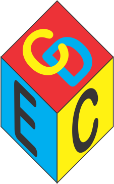

```{r setup, include=FALSE}
knitr::opts_chunk$set(echo = FALSE)
```

```{r fig.height=6, layout="l-page", echo=FALSE}
library(r2d3)
r2d3(d3_version = 4, 
     script = "d3/voronoi/voronoi.js",
     width = 300,
     height = 300)
```
----------

# <i class="fas fa-brain"></i> Objetivo 


O Projeto tem o objetivo de ensinar, trocar experiências, acessorar, temas relevantes à Ciência de dados, que nada mais é do que o estudo da Estatística e a Computação. A experiência será extraordinária, e esperamos que todos no grupo apreciem, divulguem e zele por esse projeto, pois acima de tudo o que falamos, propagaremos conhecimento, uma liberdade necessária.


